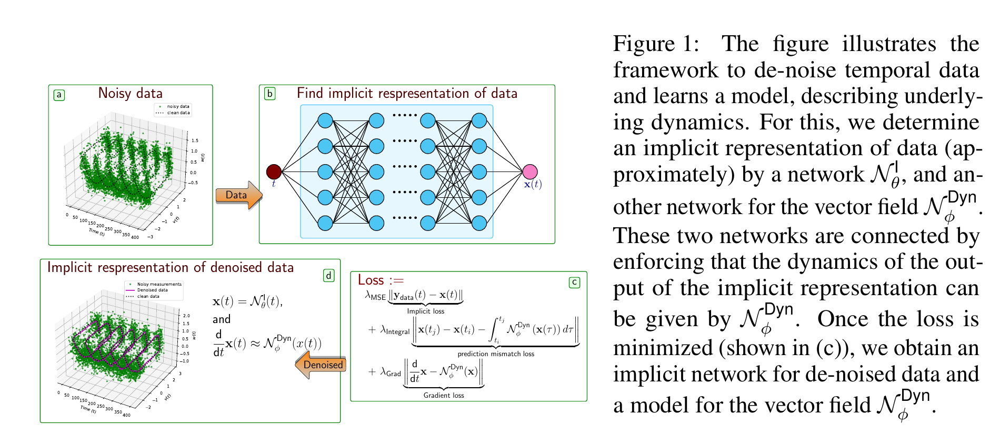

# Neural ODE for Noisy and Irregular Time Series Data

This repository contains the Python implementation using the PyTorch framework to learn nonlinear dynamical systems using neural networks from irregular and noisy data. For this, we focus on learning an approximate implicit representation of data such that a neural network can describe its dynamics. The methodology is depicted in the figure below.

<p align="center">

</p>
     
The method combines implicit neural networks with neural ordinary differential equations (ODEs) to learn the vector fields describing dynamics using corrupted and irregular-sampled data.

The important steps of the methodology are:

1. Collect measurement data  
2. Define two neural networks for approximate implicit representation of measurements and for the vector field
3. Train the networks simultaneously using the loss function shown in Figure 1
4. Prior information such as second-order dynamics can be utilized for efficient learning
 	
We utilize automatic differentiation implemented in PyTorch. 

## Contains
* `Functions` contains externalized Python routines, e.g., training and loading data
* `torchmeta` contains routines for defining networks. All these routines are directly borrowed from [https://github.com/vsitzmann/siren](https://github.com/vsitzmann/siren).  Moreover, the most of the containt of the file `modules.py` are taken from [https://github.com/vsitzmann/siren/blob/master/modules.py](https://github.com/vsitzmann/siren/blob/master/modules.py). We have put the corresponding LICENSE file for the usage of the files in this folder. For this, we express our thanks to the authors [2].
* `Examples` contains all the examples presented in the paper [1]. 

## Reproducibility 
To reproduce all the results in the paper [1], please run `./Experiments/run_all_job_gpu.sh` All the results will be saved in the folder ```.\Results\```.

## Dependencies
For reproducibility, we have stored all dependencies and their versions in `environment.yml`. A virtual environment, namely `Implicit_NODE` can be created using `conda`:
 
 ```
 conda env create -f environment.yml
 conda activate Implicit_NODE
 ``` 

## License
See the [LICENSE](LICENSE) file for license rights and limitations (MIT). 

## References
[1]. P. Goyal, and P. Benner, [Neural ODE with Irregular and Noisy Data](https://arxiv.org/abs/2205.09479), arXiv:2205.09479, 2022.

[2]. V. Sitzmann, N. P. J. Martel, A. W. Bergman, D. B. Lindell, G. Wetzstein, [Implicit Neural Representations with Periodic Activation Functions](https://proceedings.neurips.cc/paper/2020/file/53c04118df112c13a8c34b38343b9c10-Paper.pdf). In Proc. Inter. Conf. 33rd Conf. on Neural Information Processing Systems, vol. 33, 2020.

[3]. R. Chen et al., [Neural ordinary differential equations](https://dl.acm.org/doi/abs/10.5555/3327757.3327764). In Proc. 32nd Inter. Conf. on Neural Information Processing Systems. pp. 6572-6583, 2018.

[4]. P., Adam et al., [PyTorch: An Imperative Style, High-Performance Deep Learning Library](http://papers.neurips.cc/paper/9015-pytorch-an-imperative-style-high-performance-deep-learning-library.pdf). Advances in Neural Information Processing Systems, pp. 8024--8035, 2019.

## Contact
For further queries, please contact [Pawan Goyal](mailto:goyalp@mpi-magdeburg.mpg.de). 


